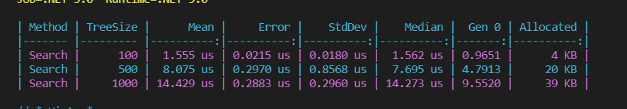

# highload-sw-arch-hw-22

## 1. Run profiler on benchmark
```
dotnet run --project ./Projctr.BinarySearchTree/Projctr.BinarySearchTree.fsproj --configuration Release
```

## 2. Observe results in console or in /BenchmarkDotNet.Artifacts/results


+ Memory usage - allocated memory, O(n) is observed
+ Runtime complexity - mean, log(n) is observed
